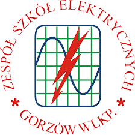

About
=====

Nagłówek 2 stopnia
------------------

.. _startmydocs:

To jest przykładowy zwykły tekst w nagłówku 2 stopnia

Nagłówek 3 stopnia
~~~~~~~~~~~~~~~~~~

.. note::

   To jest notwatka w nagłówku 2 stopnia

Nagłówek 4 stopnia 
"""""""""""""""""""

.. tip::
   to jest przykładowa wskazówka w nagłówku 4 stopnia

.. code:: javascript

   function myfunc(y){
       let x = 10
        return x+y
   }

.. code-block:: console

   (.venv) $ pip install lumache

Przykładowy link do googla `Google <https://mrdoob.com/projects/chromeexperiments/google-gravity/>`_

Lorem Ipsum is simply dummy text of the printing and typesetting industry. 
Lorem Ipsum has been the industry's standard dummy text ever since the 1500s, 
when an unknown printer took a galley of type and scrambled it to make a type specimen book. 
It has survived not only five centuries, but also the leap into electronic typesetting, 
remaining essentially unchanged. It was popularised in the 1960s with the release of Letraset sheets 
containing Lorem Ipsum passages, and more recently with desktop publishing software like Aldus PageMaker 
including versions of Lorem Ipsum.

Lorem Ipsum is simply dummy text of the printing and typesetting industry. 
Lorem Ipsum has been the industry's standard dummy text ever since the 1500s, 
when an unknown printer took a galley of type and scrambled it to make a type specimen book. 
It has survived not only five centuries, but also the leap into electronic typesetting, 
remaining essentially unchanged. It was popularised in the 1960s with the release of Letraset sheets 
containing Lorem Ipsum passages, and more recently with desktop publishing software like Aldus PageMaker 
including versions of Lorem Ipsum.

Link Wewnętrzny :doc:`usage`

* Lista wypunktowana 1 poziom
   + Lista wypunktowana 2 poziom
      - Lista wypunktowana 3 poziom

1. Lista numerowana 1 poziomu
#. To jest element listy numerowany automatycznie

what
   To jest przykładowy teksct jak coś zrobić

how
   a to jest jego wytłumaczenie

.. table:: Nagłówek ogólny tabelki
   :widths: auto

   ====================    ==================
     Nagłówek 1 Kolumny    Nagłówek 2 kolumny
   ====================    ==================
     Wartość 1 wiersza      Wartość 2 wiersza
     True                   False
     False                  True
   ====================    ==================
   
.. autosummary::
   :toctree: generated

   lumache
